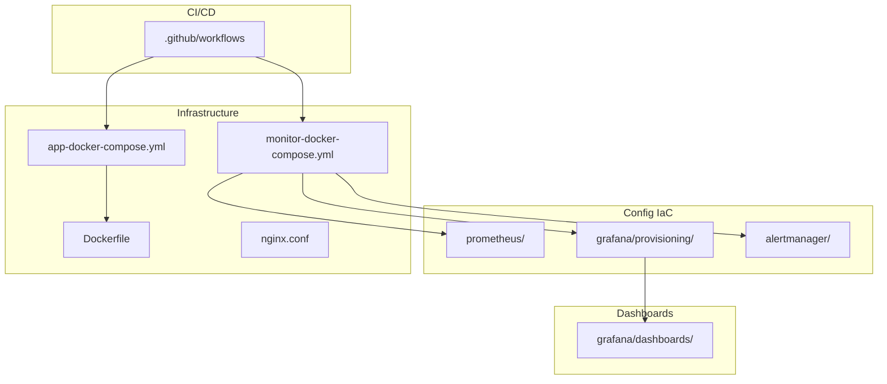
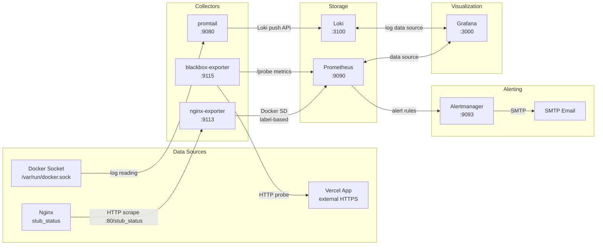

# Architecture Review: Nginx Monitor Demo

> **Project type**: DevOps / Infrastructure-as-Code (Docker · Prometheus · Grafana)
> **Java packages**: None found — no `.java` files, `pom.xml`, or `build.gradle` exist.
> This is a **monitoring stack** orchestrated via Docker Compose with IaC provisioning.

---

## 1. Directory Structure Assessment

```
nginx-monitor-demo/
│
├── .github/workflows/      # CI/CD pipeline
│   └── hello-docker.yml
│
├── Dockerfile              # Custom Nginx image build
├── nginx.conf              # Nginx server config
├── app-docker-compose.yml  # Application stack (Nginx + exporter)
├── monitor-docker-compose.yml  # Monitoring stack (Prometheus, Grafana, Loki, Blackbox, Alertmanager)
├── promtail-config.yml     # Log shipping to Loki
│
├── prometheus/             # Prometheus IaC rules
│   ├── prometheus.yml      # Scrape configs
│   ├── alert_rules.yml     # Nginx alert rules
│   ├── blackbox_rules.yml  # External probe rules
│   └── ssl_rules.yml       # SSL expiry rules
│
├── grafana/                # Grafana IaC provisioning
│   ├── dashboards/         # 4 dashboard JSONs
│   │   ├── Nginx Monitor-Dashboard.json
│   │   ├── Blackbox-Vercel-Dashboard.json
│   │   ├── DevShare-Full-Dashboard.json
│   │   └── DevShare-OTel-Dashboard.json
│   └── provisioning/
│       ├── datasources/datasource.yml
│       └── dashboards/dashboard.yml
│
├── alertmanager/
│   └── alertmanager.yml    # Email alert routing
│
├── Tips/                   # Internal documentation
│   ├── MONITORING_SEPARATION.md
│   ├── COMMANDS_REFERENCE.md
│   ├── TESTING_GUIDE.md
│   └── test-*.sh
│
├── scripts/                # Empty directory
└── README.md
```

### Organization Strategy: **Layer-based + Domain-mixed**

| Layer | Directory | Contents |
|-------|-----------|----------|
| **Presentation** | `grafana/dashboards/` | JSON dashboard definitions |
| **Configuration** | `grafana/provisioning/`, `prometheus/`, `alertmanager/` | Data sources, scrape configs, alert rules |
| **Infrastructure** | Root `.yml` + `Dockerfile` | Docker Compose, Dockerfile, nginx.conf |
| **CI/CD** | `.github/workflows/` | GitHub Actions pipeline |
| **Docs** | `Tips/` | Markdown guides + test scripts |



**Assessment**:
- ✅ **Clear separation** between application stack and monitoring stack (two `docker-compose` files)
- ✅ **IaC provisioning** for Grafana — dashboards and data sources auto-loaded at startup
- ❌ **Mixed responsibility**: `prometheus/` contains scrape configs (infra), alert rules (logic), and SSL rules (security) in one folder
- ⚠️ **`grafana/dashboards/`** has 4 JSON files with overlapping purposes — `DevShare-Full-Dashboard.json` and `Blackbox-Vercel-Dashboard.json` appear to be duplicates
- ❌ **`scripts/` is empty** — suggests incomplete tooling or dead directory

---

## 2. Service Boundaries (Module Boundaries)

Two distinct bounded contexts separated into independent Docker Compose files:

### Context 1: Application Stack (`app-docker-compose.yml`)

```
┌──────────────────────┐
│      nginx           │  Custom image (Dockerfile)
│  port 8080:80        │  Serves web content + stub_status
│  Health: /stub_status│
└────────┬─────────────┘
         │ TCP :80
         ▼
┌──────────────────────┐
│  nginx-exporter      │  Official nginx/nginx-prometheus-exporter
│  port 9113           │  Scrapes http://nginx:80/stub_status
│  Labels:             │  prometheus.monitor=true
│  job=nginx           │  prometheus.scrape_port=9113
└──────────────────────┘
```

### Context 2: Monitoring Stack (`monitor-docker-compose.yml`)

```
┌──────────┐    ┌───────────┐    ┌──────────────┐
│ Grafana  │◄───│ Prometheus│◄───│ nginx-exporter│  (Docker SD)
│ :3000    │    │ :9090     │    └──────────────┘
│          │    │           │◄───┌──────────────┐
│ Dashboards│   │ Alert     │    │ blackbox-exp │
│ auto-load│    │ Manager   │    │ :9115        │
└──────────┘    │ :9093     │    └──────────────┘
                └─────┬─────┘
                      │
                ┌─────▼─────┐
                │ Loki      │
                │ :3100     │
                └─────▲─────┘
                      │
                ┌─────┴──────┐
                │ promtail   │
                │ Docker logs│
                └────────────┘
```

### Boundary Assessment

| Boundary | Clear? | Notes |
|----------|--------|-------|
| App vs Monitoring | ✅ **Clear** | Two `docker-compose` files, shared network `global-monitor-net` |
| Nginx vs Exporter | ✅ **Clear** | Separate containers, exporter reads Nginx via HTTP |
| Prometheus vs Grafana | ✅ **Clear** | Prometheus is data source; Grafana is presentation layer |
| Alert path | ✅ **Clear** | Prometheus rules → Alertmanager → Email SMTP |
| Log path | ✅ **Clear** | Docker socket → Promtail → Loki |

⚠️ **Concern**: Both stacks share the same Docker network (`global-monitor-net: external`). This creates a **hidden coupling** — the two Compose files must be deployed in the right order, and the network must be pre-created.

---

## 3. Data Flow Direction (Dependency Direction)



### Direction Rules

| Arrow | Direction | Correct? |
|-------|-----------|----------|
| Nginx → Exporter | Pull (exporter scrapes Nginx) | ✅ |
| Exporter → Prometheus | Pull (Prometheus scrapes exporter) | ✅ |
| Blackbox → Vercel | Pull (blackbox probes external) | ✅ |
| Prometheus → Alertmanager | Push (alerts sent to AM) | ✅ |
| Alertmanager → Email | Push (SMTP) | ✅ |
| Grafana → Prometheus | Pull (queries on refresh) | ✅ |
| Grafana → Loki | Pull (log queries) | ✅ |

**All arrows point the right direction** — from producers to consumers, with no reverse dependencies.

---

## 4. Monitoring Pipeline Layers

```
┌──────────────────────────────────────────────────────────────┐
│                    PRESENTATION LAYER                        │
│  ┌────────────────────────────────────────────────────────┐  │
│  │  Grafana Dashboards                                    │  │
│  │  ├─ Nginx Monitor (connections, requests, errors)      │  │
│  │  ├─ DevShare Unified (API traffic, latency, errors)    │  │
│  │  ├─ Vercel Blackbox (probe, SSL, uptime)               │  │
│  │  └─ OTel Dashboard (CPU, RAM, API perf)                │  │
│  └────────────────────────────────────────────────────────┘  │
├──────────────────────────────────────────────────────────────┤
│                     ALERTING LAYER                           │
│  ┌──────────────────────┐      ┌────────────────────────┐   │
│  │  Prometheus Rules    │ ──── │  Alertmanager          │   │
│  │  ├─ NginxServerDown  │      │  ├─ Grouping           │   │
│  │  ├─ NginxHighError   │      │  ├─ Inhibition         │   │
│  │  ├─ NginxHighConns   │      │  └─ SMTP Email         │   │
│  │  ├─ VercelAppDown    │      └────────────────────────┘   │
│  │  └─ SSLCertExpiry    │                                    │
│  └──────────────────────┘                                    │
├──────────────────────────────────────────────────────────────┤
│                      STORAGE LAYER                           │
│  ┌──────────────────────┐  ┌────────────────────────┐       │
│  │  Prometheus (TSDB)   │  │  Loki (Logs)           │       │
│  │  Metrics retention   │  │  Log aggregation       │       │
│  └──────────────────────┘  └────────────────────────┘       │
├──────────────────────────────────────────────────────────────┤
│                     COLLECTION LAYER                         │
│  ┌──────────┐ ┌──────────────┐ ┌───────────┐ ┌──────────┐  │
│  │nginx-exp │ │ blackbox-exp │ │ promtail  │ │ Node Exp │  │
│  │:9113     │ │ :9115        │ │ :9080     │ │ :9100    │  │
│  └────┬─────┘ └──────┬───────┘ └─────┬─────┘ └─────┬────┘  │
│       │              │               │             │        │
├───────┴──────────────┴───────────────┴─────────────┴────────┤
│                      TARGET LAYER                           │
│  ┌──────────┐  ┌──────────────────┐  ┌──────────────────┐   │
│  │  Nginx   │  │  Vercel App      │  │  Docker Host     │   │
│  │:80       │  │  external HTTPS  │  │  system metrics  │   │
│  └──────────┘  └──────────────────┘  └──────────────────┘   │
└──────────────────────────────────────────────────────────────┘
```

### Layer Assessment

| Layer | Clear? | Violations |
|-------|--------|------------|
| **Target** | ✅ | Well-defined monitored entities |
| **Collection** | ✅ | Each target has a dedicated collector |
| **Storage** | ✅ | Prometheus for metrics, Loki for logs |
| **Alerting** | ✅ | Rules separate from config, routed through Alertmanager |
| **Presentation** | ✅ | Grafana with auto-provisioning |

---

## 5. Circular Dependency Analysis

### Docker Compose level

```
app-docker-compose.yml:
  nginx ──(TCP :80)──→ nginx-exporter
  (no reverse dependency)

monitor-docker-compose.yml:
  prometheus ──→ alertmanager
  grafana ──→ prometheus
  promtail ──→ loki
  (no reverse dependencies)
```

### Network level

```
global-monitor-net (external bridge)
  all containers ←→ all containers (flat L2 network)
```

⚠️ **Network-level concern**: All containers share one flat bridge network. While there are no application-level cycles, the flat network means:
- Nginx can reach Grafana (not needed)
- Prometheus can reach Nginx directly (should go through exporter)
- No network segmentation between app stack and monitoring stack

### Config level

```
prometheus/prometheus.yml
  includes → alert_rules.yml
  includes → blackbox_rules.yml
  includes → ssl_rules.yml

grafana/provisioning/datasources/datasource.yml
  references → prometheus:9090 (hardcoded service name)
```

**No circular dependencies found at any level.** All config dependencies are acyclic DAGs.

---

## 6. Clean Architecture / Hexagonal Assessment

Applying clean architecture principles (domain-centric) to a monitoring system:

```
┌──────────────────────────────────────────────────────────┐
│                     INFRASTRUCTURE                       │
│  Docker Compose · Dockerfile · nginx.conf                │
│  GitHub Actions · Docker Hub                             │
│  network: global-monitor-net                             │
├──────────────────────────────────────────────────────────┤
│                      ADAPTERS                            │
│  ┌─────────────────┐  ┌──────────────────────────────┐   │
│  │  nginx-exporter  │  │  blackbox-exporter           │   │
│  │  prometheus SD   │  │  promtail                    │   │
│  └────────┬─────────┘  └──────────┬───────────────────┘   │
├───────────┴───────────────────────┴───────────────────────┤
│                    APPLICATION                             │
│  ┌──────────────────┐  ┌────────────────────────────────┐  │
│  │  Prometheus      │  │  Grafana (provisioning)        │  │
│  │  scrape configs  │  │  dashboards, datasources       │  │
│  │  alert rules     │  └────────────────────────────────┘  │
│  └────────┬─────────┘                                      │
├───────────┴────────────────────────────────────────────────┤
│                       DOMAIN                               │
│  ┌──────────────────────────────────────────────────────┐  │
│  │  Monitoring Business Logic                           │  │
│  │  ├─ What to alert on (NginxServerDown, HighError...) │  │
│  │  ├─ Thresholds (>1000 connections, >5% errors)       │  │
│  │  ├─ Alert grouping and inhibition rules             │  │
│  │  ├─ Dashboard layout and panel definitions          │  │
│  │  └─ Metric expressions (rate, irate, histogram)      │  │
│  └──────────────────────────────────────────────────────┘  │
└──────────────────────────────────────────────────────────────┘
```

### Assessment

| Clean Architecture Principle | Status |
|------------------------------|--------|
| **Domain is innermost** | ⚠️ Partially — Alert rules (`alert_rules.yml`) encode business logic (thresholds, expressions) alongside infrastructure config |
| **Adapters connect to domain** | ✅ Exporters and collectors are pure adapters — they don't contain business rules |
| **Infrastructure is outermost** | ✅ Docker Compose, Dockerfile are pure infrastructure |
| **Dependencies point inward** | ✅ All configs reference downward, never upward |
| **Business rules are testable** | ⚠️ Alert rules can only be tested live (Promtool checks syntax only, not semantics) |

---

## 7. Summary of Findings

### Critical Issues (0)
None found.

### High Severity (0)
None found.

### Medium Severity

| Issue | Location | Recommendation |
|-------|----------|----------------|
| **Duplicate dashboards** | `grafana/dashboards/` | `DevShare-Full-Dashboard.json` and `Blackbox-Vercel-Dashboard.json` overlap significantly (85%+ panel similarity). Consolidate into one. |
| **Flat shared network** | `global-monitor-net` | App and monitoring stacks can communicate freely. Use **network segmentation** — create `app-net` and `monitor-net`, connect only Prometheus to both. |
| **Empty directory** | `scripts/` | Remove or populate with real utility scripts. |

### Low Severity

| Issue | Location | Recommendation |
|-------|----------|----------------|
| **Prometheus rules co-located** | `prometheus/` | Separate `rules/` subdirectory for `alert_rules.yml`, `blackbox_rules.yml`, `ssl_rules.yml` |
| **Missing Docker healthchecks** | `monitor-docker-compose.yml` | Add `HEALTHCHECK` to Prometheus, Grafana, Alertmanager containers |
| **No rate limiting on Alertmanager** | `alertmanager.yml` | Consider adding rate limiting to prevent email flooding |

---

## 8. Recommended Improvements

### Short-term (low effort, high impact)

```yaml
# Network segmentation: Split into app-net and monitor-net
networks:
  app-net:        # nginx + exporter only
  monitor-net:   # prometheus, grafana, alertmanager, loki, blackbox
  monitoring:    # bridge network connecting only prometheus to app-net
```

```yaml
# Grafana auto-provisioning: Clean up duplicate datasource files
# grafana/provisioning/datasources/
#   datasource.yml  (remove prometheus-datasource.yml — it's empty!)
```

### Medium-term

```
prometheus/
├── prometheus.yml       # Main config
├── rules/               # ← Group all rule files here
│   ├── alert_rules.yml
│   ├── blackbox_rules.yml
│   └── ssl_rules.yml
└── targets/             # Optional: target definitions
    └── static.yml
```

### Long-term

- **OpenTelemetry migration**: Replace `nginx-exporter` + `blackbox-exporter` with OTel Collector for unified telemetry pipeline (partially started — `.env.example` already has `OTEL_*` vars)
- **Kubernetes readiness**: Package as Helm chart for easier scaling beyond single-host Docker Compose

---

## 9. Metrics Collected in Grafana Dashboards

### Nginx Monitor Dashboard
| Panel | Metric | Source |
|-------|--------|--------|
| Nginx Status | `nginx_up` | nginx-exporter |
| Processed Connections | `rate(nginx_connections_accepted[5m])`, `rate(nginx_connections_handled[5m])` | nginx-exporter |
| Active Connections | `nginx_connections_active/reading/waiting/writing` | nginx-exporter |
| Total Requests | `rate(nginx_http_requests_total[5m])` | nginx-exporter |

### DevShare Full Dashboard (Vercel App Monitoring)
| Panel | Metric | Source |
|-------|--------|--------|
| Probe Status | `probe_success` | blackbox-exporter |
| HTTP Status Code | `probe_http_status_code` | blackbox-exporter |
| Response Time | `probe_duration_seconds` | blackbox-exporter |
| Request Phase Breakdown | `probe_http_duration_seconds{phase="connect\|tls\|processing"}` | blackbox-exporter |
| API Latency (p50/p95/p99) | `histogram_quantile(..., http_server_duration_milliseconds_bucket)` | OTel / app metrics |
| CPU / RAM Usage | `process_cpu_usage`, `process_memory_usage_bytes` | OTel / app metrics |

### DevShare OTel Dashboard
Same API performance panels as Full Dashboard (overlap) plus OTel-specific CPU/RAM.

### Blackbox Vercel Dashboard
Same as DevShare Full Dashboard — near-duplicate.

---

## 10. Conclusion

| Dimension | Score (1-5) | Notes |
|-----------|-------------|-------|
| **Structure** | 4/5 | Well-organized with clear layer separation |
| **Boundaries** | 4/5 | Two-Stack approach is clean, but network is flat |
| **Dependency Direction** | 5/5 | All arrows point the right way |
| **Layering** | 5/5 | Target → Collector → Storage → Alerting → Presentation |
| **No Cycles** | 5/5 | No circular dependencies found |
| **Clean Architecture** | 4/5 | Domain logic (alert rules) mixed with config, but otherwise clean |

**Overall**: A well-structured monitoring infrastructure project. The two-stack architecture (app + monitoring) is a good separation pattern. Main improvements are network segmentation, rule file organization, and dashboard deduplication.
