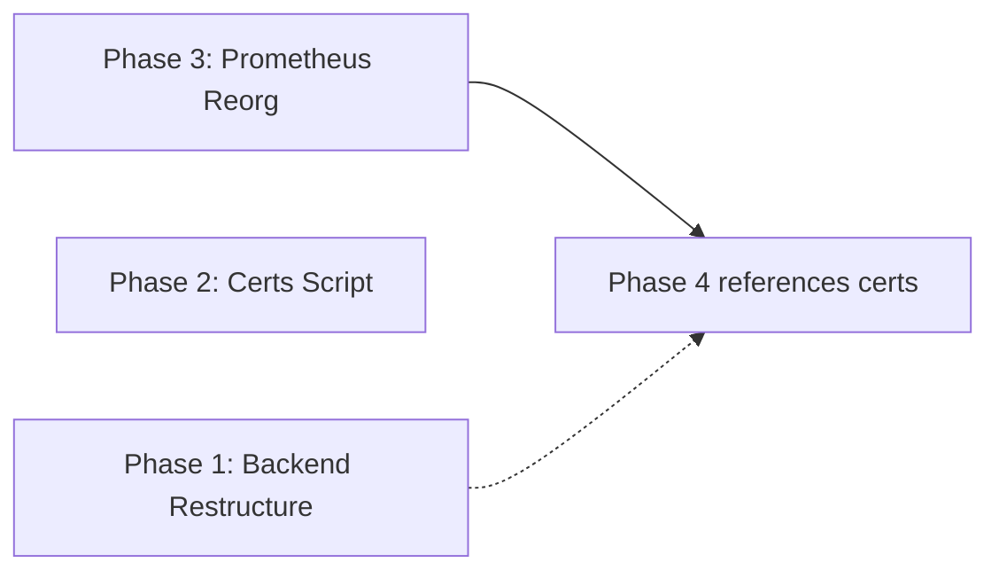

# Restructure nginx-monitor-demo — Implementation Plan

## Summary

4 independent phases that restructure backend code for mTLS readiness, add cert generation, reorganize Prometheus rules, and finalize the docker-compose monitoring stack. Each phase is backward-compatible — moved files re-export from old locations.

## Phases Overview

| Phase | Description | Effort | Dependencies |
|-------|-------------|--------|--------------|
| 1 | Restructure Backend (certs.ts, pool.ts, requestLogger.ts) | 2h | None |
| 2 | Create certs/ + generate script | 1h | None |
| 3 | Reorganize Prometheus rules into subdirectory | 1h | None |
| 4 | Update monitor docker-compose with blackbox config | 2h | Phase 3 (rules paths) |

## Dependency Graph

## File Ownership Map

| File | Phase | Owner |
|------|-------|-------|
| `app/reddit_backend/src/db/pool.ts` | 1 | New |
| `app/reddit_backend/src/startup/certs.ts` | 1 | New |
| `app/reddit_backend/src/middleware/requestLogger.ts` | 1 | New |
| `app/reddit_backend/src/db.ts` | 1 | Modify (re-export) |
| `app/reddit_backend/src/access-logger.ts` | 1 | Modify (re-export) |
| `app/reddit_backend/src/index.ts` | 1 | No change needed |
| `app/reddit_backend/src/routes/*.ts` | 1 | No change needed |
| `.gitignore` | 2 | Modify (add cert patterns) |
| `scripts/generate-certs.sh` | 2 | New |
| `prometheus/rules/alert_rules.yml` | 3 | Move from `prometheus/` |
| `prometheus/rules/blackbox_rules.yml` | 3 | Move from `prometheus/` |
| `prometheus/rules/ssl_rules.yml` | 3 | Move from `prometheus/` |
| `prometheus/blackbox.yml` | 3 | New (blackbox exporter config) |
| `prometheus/prometheus.yml` | 3,4 | Modify (paths + node job) |
| `monitor-docker-compose.yml` | 4 | Modify (blackbox volume + node) |
